# any-shape-middleware

> One endpoint, any reasonable input shape, schema-validated output.



Express middleware that lets a single REST endpoint accept payloads in *any reasonable shape* and normalize them to your zod schema before the route handler runs — without giving up validation, type safety, or determinism guarantees.

When a payload doesn't match the schema, an LLM rewrites it to fit, a second LLM pass checks that nothing was fabricated, and only then does your handler see the body. If the rewrite would have to invent fields, the request is rejected — your handler never receives made-up data.

## Install

```sh
# Minimal install (package + AI SDK):
npm install any-shape ai @ai-sdk/openai
```

The provider SDK is an **optional peer dependency** — install only the one you'll use:
- `@ai-sdk/openai`
- `@ai-sdk/anthropic`
- `@ai-sdk/google`

## Quickstart

```ts
import express from 'express';
import { anyFormat } from 'any-shape-middleware';
import { z } from 'zod';

const userSchema = z.object({
  id: z.string(),
  name: z.string(),
  age: z.number(),
  email: z.string().email(),
});

const app = express();
app.use(express.json());

app.post('/user', anyFormat(userSchema), (req, res) => {
  res.json(req.body); // already typed and validated
});

// per-route: skip the verification/fact-check pass (one LLM call instead of two on slow path)
app.post('/user-fast', anyFormat(userSchema, { skipVerification: true }), (req, res) => {
  res.json(req.body);
});

app.listen(3000);
```

```sh
# fast path — payload already valid, no LLM call
curl -X POST :3000/user -H 'content-type: application/json' \
  -d '{"id":"u1","name":"Ada","age":36,"email":"ada@example.com"}'

# slow path — different shape, LLM reshapes + fact-checks
curl -X POST :3000/user -H 'content-type: application/json' \
  -d '{"userId":"u1","fullName":"Ada Lovelace","yearsOld":36,"emailAddress":"ada@example.com"}'

# 422 — required fields missing from input
curl -X POST :3000/user -H 'content-type: application/json' \
  -d '{"name":"Ada","age":36}'
```

## Configuration

By default the middleware reads two environment variables:

| Var            | Default        | Notes                                       |
| -------------- | -------------- | ------------------------------------------- |
| `AI_PROVIDER`  | `openai`       | `openai` \| `anthropic` \| `google`         |
| `AI_MODEL`     | provider-default | `gpt-4o-mini` / `claude-sonnet-4-5` / `gemini-2.5-flash` |

Plus the provider's API key env var (`OPENAI_API_KEY`, `ANTHROPIC_API_KEY`, `GOOGLE_GENERATIVE_AI_API_KEY`).

### Override

Pass any `LanguageModel` from the AI SDK explicitly:

```ts
import { anyFormat, createAnyFormatService } from 'any-shape';
import { openai } from '@ai-sdk/openai';

app.post(
  '/user',
  anyFormat(userSchema, {
    model: openai('gpt-4o'),
  }),
  handler,
);
```

You can also skip verification per route call:

```ts
app.post('/user', anyFormat(userSchema, { skipVerification: true }), handler);
```

## How it works

1. **Fast path** — payload validates against the zod schema → straight through, zero LLM calls.
2. **Slow path** — validation fails → middleware sends `(payload, schema)` to the LLM, asks for a rewrite, re-validates the result with zod.
3. **Fact-check** — a second LLM pass compares original ↔ rewrite and reports any fields with values not derivable from the input.
4. **Reject** — `422 insufficient_data` if required fields couldn't be filled, `400 reshape_failed` if the LLM tried to invent values.

```
         ┌── valid? ── yes ──────────────► next()
   body ─┤
         └── no ──► transform ──► fact-check ──┬── ok ──────────► next()
                                               ├── insufficient ► 422
                                               └── hallucinated ► 400
```

## What this is *not*

- **Not a replacement for API versioning.** This is a safety net for *shape* mismatch, not for breaking semantic changes.
- **Not invoked on every request.** The fast path is a normal zod parse. The LLM only runs when a request would have been rejected anyway.
- **Not freeform.** Output is bound by zod validation + the fact-checker. The LLM cannot relax types, invent fields, or bypass the schema.

## Tradeoffs

| Concern                | Reality                                                                                                      |
| ---------------------- | ------------------------------------------------------------------------------------------------------------ |
| LLM latency, slow path | Two LLM calls per non-conforming request (transform + fact-check). Fast path adds zero overhead.             |
| Cost                   | Triggers only on shape mismatch; the alternative was a `400` anyway. Fact-check doubles the per-rewrite cost. |
| Non-determinism        | Output is constrained by zod validation + fact-checker. Failures fail closed.                                |
| Hallucinated fields    | Fact-checker rejects with `400` if the rewrite contains values not derivable from input.                     |

## License

MIT
